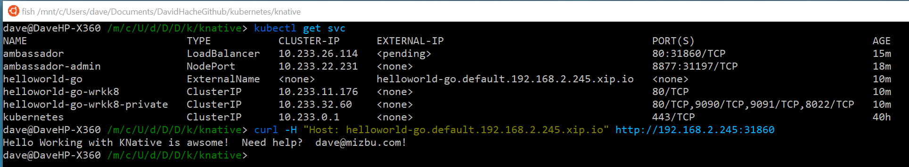
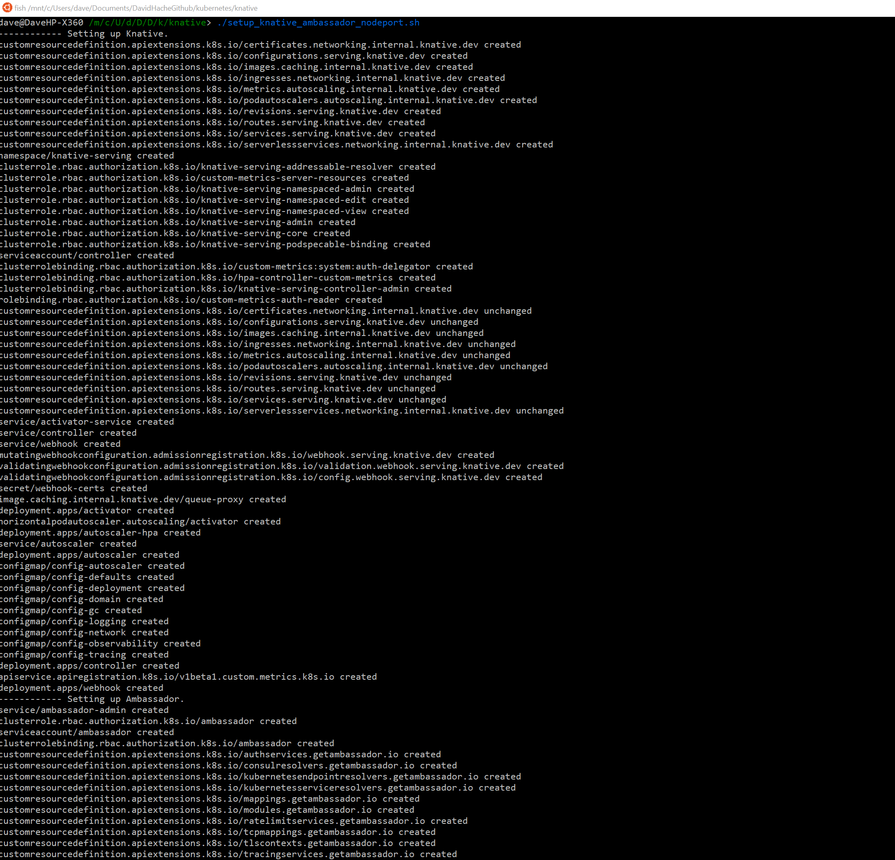
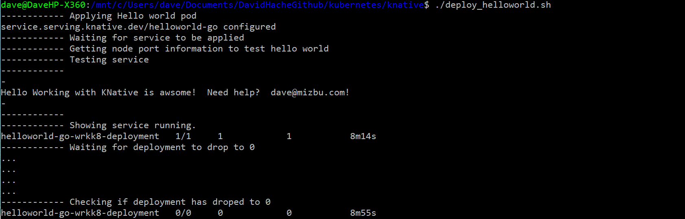
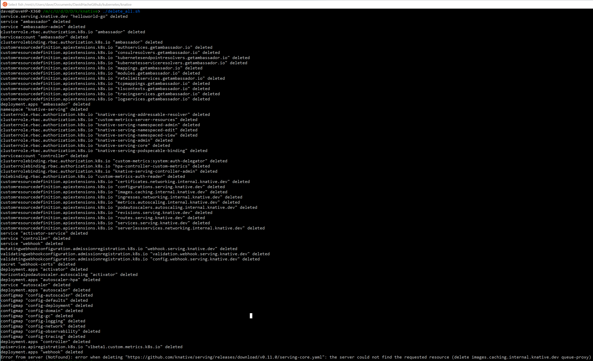

# Jump start scripts to test Knative on Kubernetes without load balancing.

This folder has scripts to help you jump start your exploration of Knative.

I was running into issues with the lack of load balancing on my cluster.

The solution is to hijack the header without the port number with curl.

But while I was figuring it out, I wrote a few lines of code to accelerate my deployment.  Hopefully this can be useful.

This script does the knative setup with ambassador.

[setup_knative_ambassador.sh](setup_knative_ambassador.sh)

This script installs a Hello world demo.

[deploy_helloworld.sh](deploy_helloworld.sh)

And yes, you figured it out, this cleans up.

[delete_all.sh](delete_all.sh)

