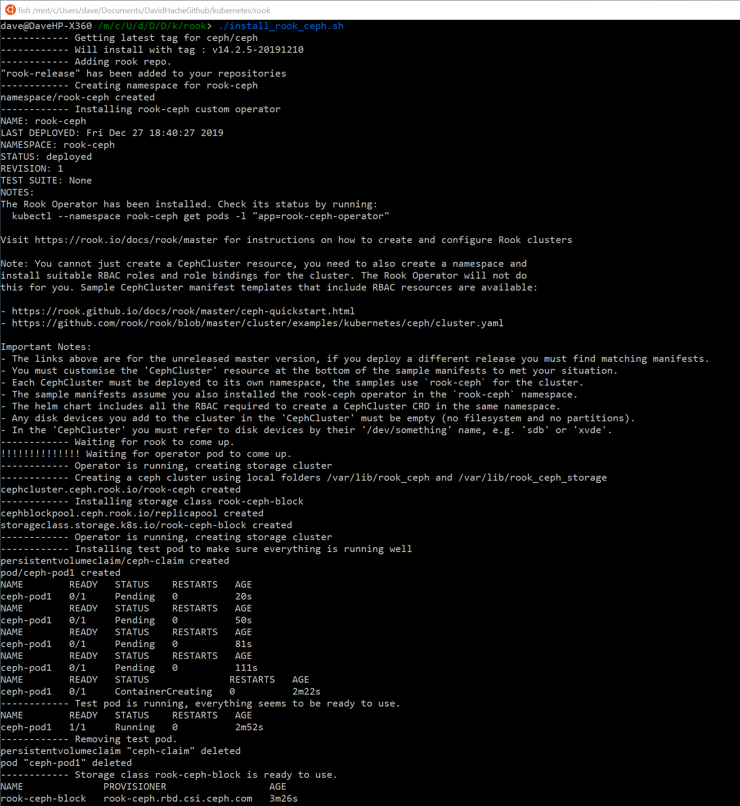
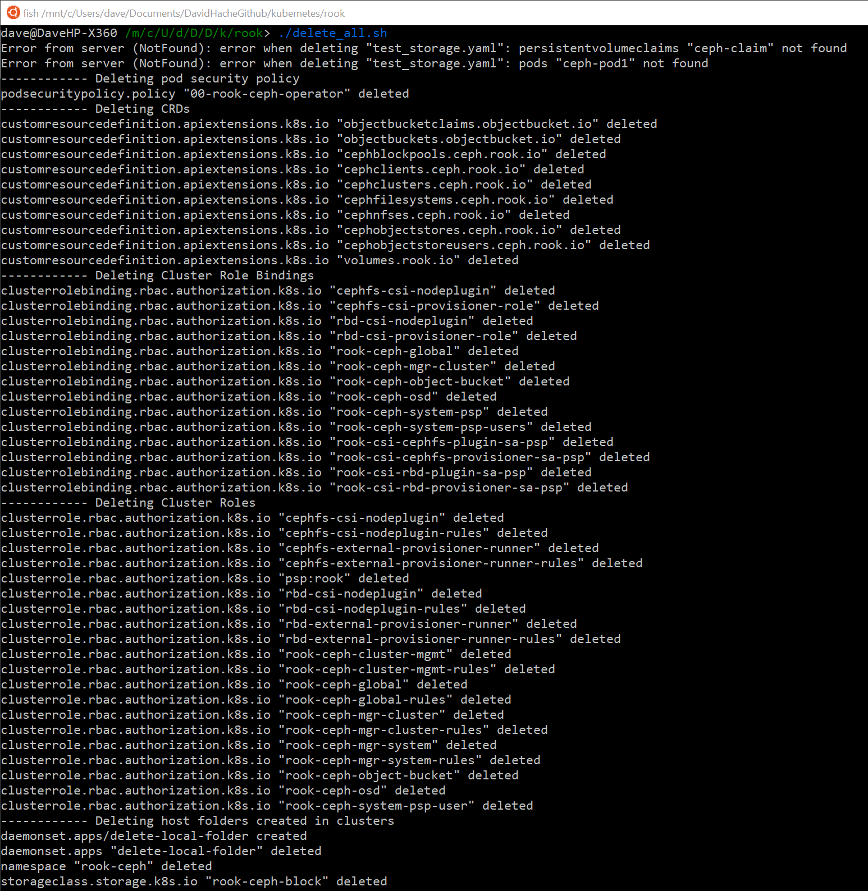

# Small scripts to kick start exploring rook storage.

## ./install_rook_ceph.sh

* Installs the CRD's
* Creates a cluster with local storage.
* Tests it all.  
**It will wait 5min for the test to complete.**

*Storage will be hosted on the workers in the folders: /var/lib/rook_ceph and /var/lib/
rook_ceph_storage.* 

## **This is for testing only as Rook doesn't suggest to use this for production!!!!!**

[install_rook_ceph.sh](install_rook_ceph.sh)

## ./delete_all.sh

This script will do a full cleanup.

[delete_all.sh](delete_all.sh)

## Other Files

* Rook Ceph storage cluster definition: cluster.yaml
* Delete file for rook ceph storage cluster: delete_ceph.sh
* Daemon set to run (*#/rm -rf /usr/lib/rook_ceph*) on all hosts: remove_host_folder.yaml
* Pod to test that the storage is well setup:  test_storage.yaml